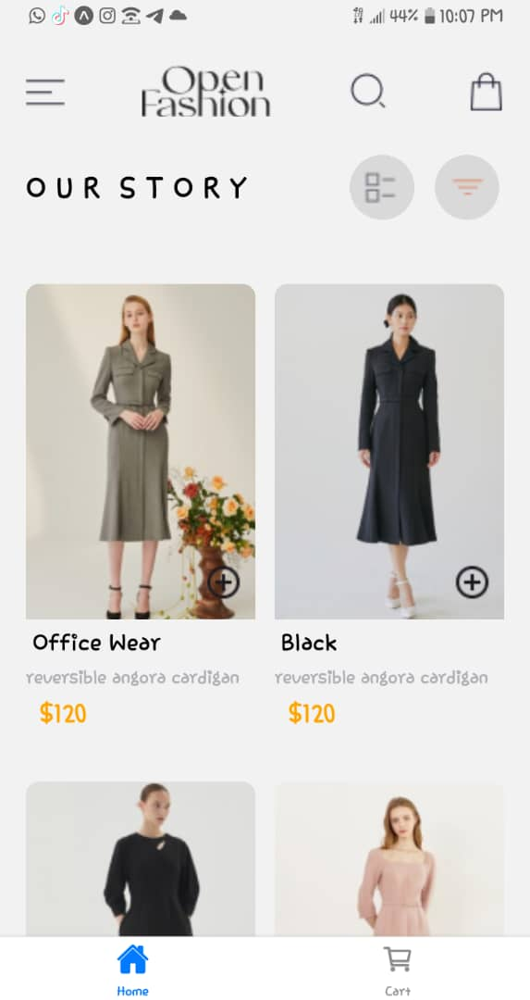
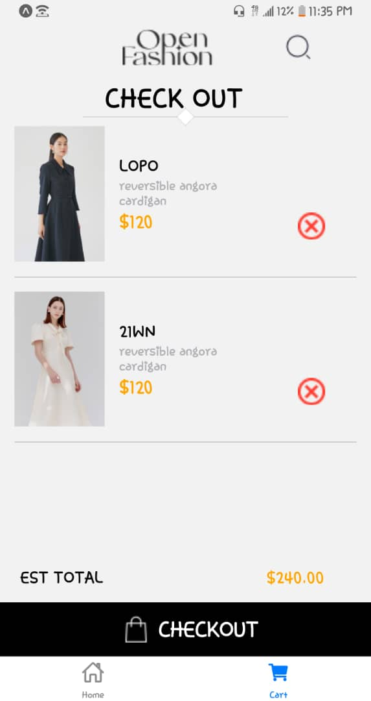

# rn-assignment6-ID-11116471

# HomeScreen Component 

## Overview
The `HomeScreen` component in this React Native application serves as the main interface for browsing and selecting products. It allows users to view various clothing items, their details, and add them to their shopping cart.

## Design Choices
### Header and Navigation
- **Header:** Displays the application logo, menu for navigation, search icon for finding products, and shopping bag icon for navigating to the cart.
- **Navigation Icons:** Includes icons for list view and filtering options to enhance user experience.

### Product Display
- **Grid Layout:** Products are displayed in a responsive grid layout using `flexWrap: 'wrap'` to ensure they adapt to different screen sizes.
- **Product Cards:** Each product is presented in a card-like structure showing its image, name, description, and price clearly.

### Add to Cart Functionality
- **Async Storage:** Utilizes `AsyncStorage` from `@react-native-async-storage/async-storage` for local data storage.
- **Add to Cart Button:** Enables users to add products to their cart. Upon tapping the button, the selected product is stored locally in AsyncStorage.

## Implementation of Data Storage
- **AsyncStorage:** 
- **Stores** user's cart data locally on the device.
- **Updates** the cart with new products using AsyncStorage, ensuring persistence across app sessions for a seamless shopping experience.
  ## SCREENSHOT FOR HOME SCREEN
  

# CartScreen Component

The CartScreen component is part of a shopping application built using React Native. It allows users to view their selected items in the cart, remove items, and see the total cost of their cart.

## Design Choices

### User Interface:
- **Header**: Includes a logo and search icon for branding and navigation.
- **Title**: "CHECK OUT" title is styled with a bold font and underlined to emphasize its importance.
- **Product List**: Each product in the cart is displayed with its image, name, description, and price. Users can remove items using a remove button.
- **Total Cost**: The total cost of the items in the cart is displayed at the bottom of the screen.

### Implementation Details:
- **State Management**: Uses React's `useState` hook to manage cart items (`cart`) and total cost (`totalCost`).
- **AsyncStorage**: Utilizes AsyncStorage from `@react-native-async-storage/async-storage` to persist cart data locally on the device. Cart items are stored as JSON strings and retrieved using `getItem` and `setItem` methods.
- **Effect Hook**: Implements `useEffect` hook to fetch cart data from AsyncStorage when the component mounts, ensuring the cart state is updated with the latest data.
 
## Dependencies

- `@react-native-async-storage/async-storage`: Used for storing cart data locally.
- `@react-navigation/native @react-navigation/bottom-tabs`: Enables navigation and bottom tab navigation within the application.
react-native-screens`: Facilitates efficient native navigation for screens in React Native.
- `react-native-safe-area-context`: Ensures content is displayed correctly within the safe area boundaries of a device.

 ## SCREENSHOT FOR CART SCREEN
  
 

